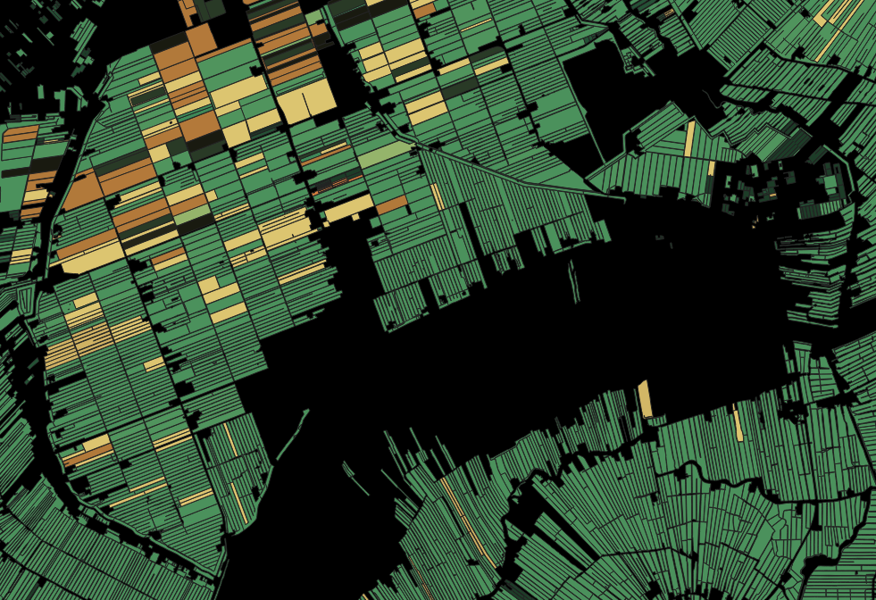

# Basis Registratie Gewas Percelen (BRP)

De BRP - Gewaspercelen bestaat uit de locatie van landbouwpercelen in Nederland met daaraan gekoppeld het geteelde gewas. 
Het bestand is een selectie van informatie uit de Basisregistratie Percelen (BRP) van Dienst Regelingen. 

De omgrenzingen van de landbouwpercelen zijn gebaseerd op de begrenzingen uit het AAN-bestand (Agrarische Areaal Nederland)
De gebruiker van het perceel dient jaarlijks zijn actuele gewaspercelen in te tekenen en aan te geven welk gewas wordt geteeld op het betreffende perceel.

De bestanden worden geleverd in het ESRI format File-Geodatabase (versie 9.3)

Jaren beschikbaar: 2009 tot en met 2018

**Bron url:** https://www.pdok.nl/introductie?articleid=1948958

## Gebruiksvoorwaarden

Gebruiksvoorwaarden open data:
http://www.rijksoverheid.nl/opendata/voorwaarden

## Attributen

Het bestand bevat de volgende attributen:

| Attribuut          | Voorbeeld | Beschrijving | 
|----------         |-----------|--------------|
|CAT_GEWASCATEGORIE | Bouwland  | Gewascategorie van het gewas op het perceel |
|GWS_GEWAS          | Aardappelen, consumptie- op kleigrond| Gewas op het perceel|
|GWS_GEWASCODE      | 1909 | Gewascode van het gewas|
| Shape_Area        | 88703.9 | Oppervlakte m2 | 

## Download
http://geodata.nationaalgeoregister.nl/brpgewaspercelen/atom/brpgewaspercelen.xml

### Clip op Provincie Zuid-Holland

Het script [/BRP_Basisregistratie_gewas_percelen/clip_filter_pzh.fmw](clip_filter_pzh.fmw) download de data, clipt het op Provincie Zuid-Holland en exporteerd het naar een GeoPackage bestand. 

## Services url

### WMS
https://geodata.nationaalgeoregister.nl/brpgewaspercelen/wms?request=GetCapabilities&service=wms

### WFS
https://geodata.nationaalgeoregister.nl/brpgewaspercelen/wfs?request=GetCapabilities&service=wfs

## AgroDataCube

De data van de BOFEK2012 is ook beschikbaar via de AgroDataCube API.

https://documenter.getpostman.com/view/3862510/RVnSHh76#0f2925c7-1281-4d5f-b6fd-b157436ca6b7