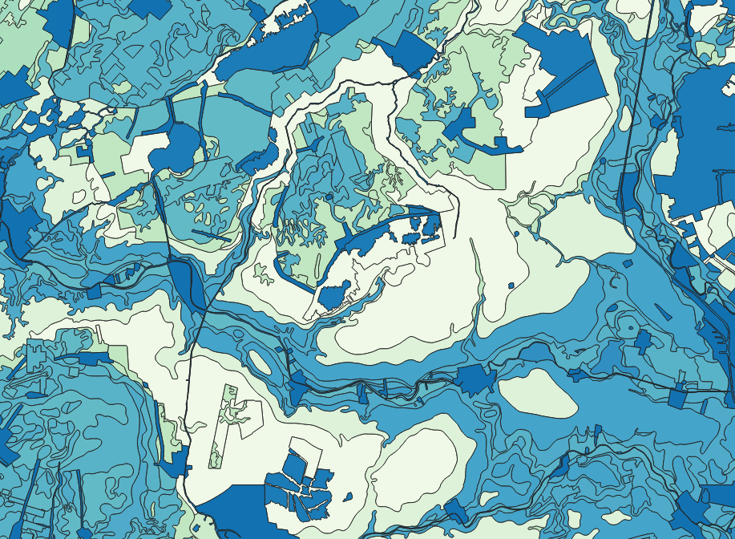

# Bodemfysische Eenhedenkaart (BOFEK2012)

BOFEK2012 is een GIS-bestand met daarin de ruimtelijke verbreiding van bodemfyisische eenheden. Dit zijn gebieden met een overeenkomstige bodemopbouw en een overeenkomstig hydrologisch gedrag.

Er worden 72 verschillende eenheden onderscheiden. Aan een bodemfysische eenheid is een geschematiseerd bodemprofiel gekoppeld en aan de afzonderlijke lagen in het bodemprofiel kunnen aan de hand van de Staringreeks belangrijke bodemfysische karakteristieken worden toegevoegd. De indeling is afgeleid van de Bodemkaart van Nederland, schaal 1 : 50 000.

Meer achtergrondinformatie is te vinden in [Alterra-rapport 2387](http://content.alterra.wur.nl/Webdocs/PDFFiles/Alterrarapporten/AlterraRapport2387.pdf) en in de [metainformatie](https://www.wur.nl/upload_mm/f/d/5/0118fa52-a126-4e6d-95d5-e66a96f6cdbb_metadata_BOFEK_2012_versie%202_1.pdf).

**Jaar:** 2012

**Projectie:** Amersfoort RD New EPSG:28992

**Bron Url:** https://www.wur.nl/nl/show/Bodemfysische-Eenhedenkaart-BOFEK2012.htm

## Attributen

Het bestand bevat de volgende attributen:

| Attribuut          | Voorbeeld | Beschrijving | 
|----------         |-----------|--------------|
|BOFEK2012 | 101  | Nummer van de bofekeenheid voor koppeling met de profielschets waarin de bodemopbouw schematisch wordt weergegeven. |
|PAWN          |  1 | Nummer van de PAWN-eenheid. Dit is een globale indeling van de bodemopbouw naar bodemfysisch gedrag in 23 eenheden (Wosten, J.H.M., F.de Vries, J. Dennboom en A.F. van Holst, 1988. Generalisatie en bodemfysische vertaling van de bodemkaart van Nederland, 1 : 250 000, ten behoeve van de PAWN-studie. Wageningen, Stiboka, rapport 2055) | 

## Download

https://www.wur.nl/upload_mm/1/7/6/61a0f2aa-4cd1-4b5e-90db-9498465d3b6a_BOFEK2012_bestandenVersie2_1.zip

## Clip op Provincie Zuid-Holland

Het script [/Bodemkaart_BOFEK_2012/clip_filter_pzh.fmw](clip_filter_pzh.fmw) download de data, clipt het op Provincie Zuid-Holland en exporteerd het naar een GeoPackage bestand. 

## AgroDataCube

De data van de BOFEK2012 is ook beschikbaar via de AgroDataCube API.

https://documenter.getpostman.com/view/3862510/RVnSHh76#0f2925c7-1281-4d5f-b6fd-b157436ca6b7