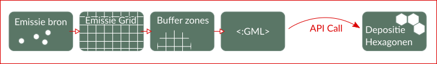

# DataDomeinDagen Stikstof Casus

:radio_button: -> mee bezig
:ballot_box_with_check: -> beschikbaar
:large_orange_diamond: -> nog achteraan gaan

## Emissie data Landbouw

| Directory              | feature | titel | Beschrijving | Data Bron | Aanwezig? | 
|----                    | ------- |-------| -------------| ----------|-----------|
| [RVO_landbouwtellingen](./RVO_landbouwtellingen)  | Punt Bronnen | Stal Emissies | Punten met stal emissies, dier aantallen etc. | RVO | :ballot_box_with_check: |
|                    | GRID    | ? | 500x500 aggregatie grid | Emissieregistratie | :ballot_box_with_check:|

**Voorwaarden gebruik:** [2019-01-30_Stikstofcasus_Maatregelen_ter_bescherming_data_TOP.pdf](2019-01-30_Stikstofcasus_Maatregelen_ter_bescherming_data_TOP.pdf)

| Directory              | feature | titel | Beschrijving |Data Bron |Aanwezig? | 
|----                    | ------- |-------| -------------|----------|----------|
|[INITIATOR_beweiden_bemesten](INITIATOR_beweiden_bemesten) | GRID  |Beweiden bemesten | 100X100 Amoniak concentratie | WUR INITIATOR | :ballot_box_with_check:| 
|                        | GRID  |Beweiden bemesten | 500X500 | PZH  | :large_orange_diamond:| 

**Voorwaarden gebruik:** Zie README.md

## Emissie data Industrie & Scheepsvaart 

**Data bron:** Rijnmond industrie / scheepvaart. Set van HbR 

| Directory              | feature | titel | Beschrijving |Data Bron |Aanwezig? | 
|----                    | ------- |-------| -------------|----------|----------|
| [HIC_havenbedrijf](HIC_havenbedrijf)    |     features   |Rijnmond industrie / scheepvaart | Datasets van Rijnmond gebied | HbR | :ballot_box_with_check:|
|     | GRID   |Industrie | 500x500 |           |:ballot_box_with_check:|
|     | GRID   |Scheepsvaart| 500x500 |         |:large_orange_diamond:|

**Voorwaarden gebruik:** Intern houden. PZH is bronhouder.

**Data bron:** DCMR

| Directory              | feature | titel | Beschrijving |Data Bron |Aanwezig? | 
|----                    | ------- |-------| -------------|----------|----------|
|   [DCMR_overige_industrie](DCMR_overige_industrie)  |   features | Overige industrie    |  Industrie uitstoot (buiten havengebied) .pdf | DCMR | :ballot_box_with_check: |
|     | Table   |  | excel |           |:radio_button:|
|     | GRID   |  | 500x500 |           |:large_orange_diamond:|

**Voorwaarden gebruik:** ??? 

## Emissie data Verkeer

**Data bron:**  

| Directory              | feature | titel | Beschrijving |Data Bron |Aanwezig? | 
|----                    | ------- |-------| -------------|----------|----------|
|   [NSL_monitordata](./NSL_monitordata)|  features? |  verkeer  | Op basis van licht/midden/zwaar verkeer, files etc. Velden zijn aanwezig in NSL data| NSL-monitordata | :ballot_box_with_check: |
|          | GRID | Verkeer | | EmissieRegistratie | :ballot_box_with_check:|

**Voorwaarden gebruik:** Open data

## Emissie data Wonen

| Directory              | feature | titel | Beschrijving |Data Bron |Aanwezig? | 
|----                    | ------- |-------| -------------|----------|----------|
| [BAG_wonen_werken](./BAG_wonen_werken) |feature| BAG |BAG| BAG |:ballot_box_with_check: |
| [BAG_wonen_werken](./BAG_wonen_werken) |feature| BAG |BAG specifieke extract | PZH |:radio_button: |
|     | GRID   |  | 500x500 |   Emissieregistratie      |:ballot_box_with_check:|

**Voorwaarden gebruik:** Open data

## Emissie data Glastuinbouw

| Directory              | feature | titel | Beschrijving |Data Bron |Aanwezig? | 
|----                    | ------- |-------| -------------|----------|----------|
| [LGN7_landgebruik](./LGN7_landgebruik) |feature| LGN7 landgebruik |Uitsnede PZH van LGN7 landgebruik in GDB| RIVM |:ballot_box_with_check: |
|     | GRID   |  | 500x500 |Emissieregistratie|:ballot_box_with_check:|

**Voorwaarden gebruik:** [2019-01-30_Stikstofcasus_Maatregelen_ter_bescherming_data_TOP.pdf](2019-01-30_Stikstofcasus_Maatregelen_ter_bescherming_data_TOP.pdf)

## Depositie Data : Totale depositie opbouw 

| Directory              | feature | titel | Beschrijving |Data Bron |Aanwezig? | 
|----                    | ------- |-------| -------------|----------|----------|
|[RIVM_depositieopbouw](./RIVM_depositieopbouw)| Hexagonen | Totale depositie | 1ha Hexagonen grid met depostie per sector | RIVM | :ballot_box_with_check: |

 **Voorwaarden gebruik:**??

## Aanvullende datasets

| Directory              | feature | titel | Beschrijving |Data Bron |Aanwezig? | 
|----                    | ------- |-------| -------------|----------|----------|
| [Maatregelen](./Maatregelen)| CSV | Maatregelingen | maatregelen en kosten baten inschatting | PZH |:ballot_box_with_check: |
| [Default_grid_500](./Default_grid_500)| feature | Default grid | standaard aggreagtie grid 500x500 m | PZH | :ballot_box_with_check: |

## Voorwaarden data RVO en RIVM

Voor de levering vanuit de RVO, en de daarmee samenhangende levering vanuit het RIVM, gelden de volgende voorwaarden:

* de gegevens mogen alleen worden gebruikt voor het aangegeven doel;
* de gegevens mogen niet ter beschikking worden gesteld aan derden;
* de gegevens moeten worden vernietigd, zodra het bezit ervan, voor u niet meer noodzakelijk is voor het aangegeven doel;
* de eventuele onderzoeksresultaten mogen niet op zodanige wijze worden gepubliceerd, dat ze naar afzonderlijke bedrijven of individuele personen herleidbaar zijn;
* de gegevens van de Landbouwtelling zijn ingewonnen voor statistische en beleidsdoeleinden en zijn niet fysiek gecontroleerd;
* voor eventuele bewerkingen die op de door Rijksdienst voor Ondernemend Nederland (RVO.nl) verstrekte gegevens hebben plaatsgevonden na de verstrekking draagt RVO.nl geen verantwoordelijkheid;
* RVO.nl is niet aansprakelijk voor eventuele gevolgen van het gebruik van de door haar verstrekte gegevens.

Bij persoonsgegevens dient de afnemer hier op grond van de Algemene verordening gegevensbescherming (Avg) behoorlijk en zorgvuldig mee om te gaan. Afnemer verleent RVO.nl volledige medewerking om binnen de wettelijke termijnen te voldoen aan de verplichtingen op grond van de Avg. Meer in het bijzonder de rechten van betrokkene (gebruiker) wiens gegevens de afnemer ontvangt, zoals een verzoek om inzage, verbetering, aanvulling, verwijdering of afscherming van persoonsgegevens en het uitvoeren van een gehonoreerd aangetekend verzet. 

Daarnaast geldt de voorwaarde dat de gegevens niet gepubliceerd worden op zo’n manier dat ze herleidbaar zijn tot individuele bedrijven, de gegevens niet gebruikt worden voor handhaving én de gegevens niet worden gebruikt om ondernemers direct te benaderen.

Het bestand [2019-01-30_Stikstofcasus_Maatregelen_ter_bescherming_data_TOP.pdf](2019-01-30_Stikstofcasus_Maatregelen_ter_bescherming_data_TOP.pdf) bevat : 

1. het verzoek zoals geformuleerd aan de externe partijen
2. de algemene voorwaarden zoals gesteld door de externe partijen, 
3. de datalevering en
4. de maatregelen die genomen zijn ter bescherming van de datasets.
